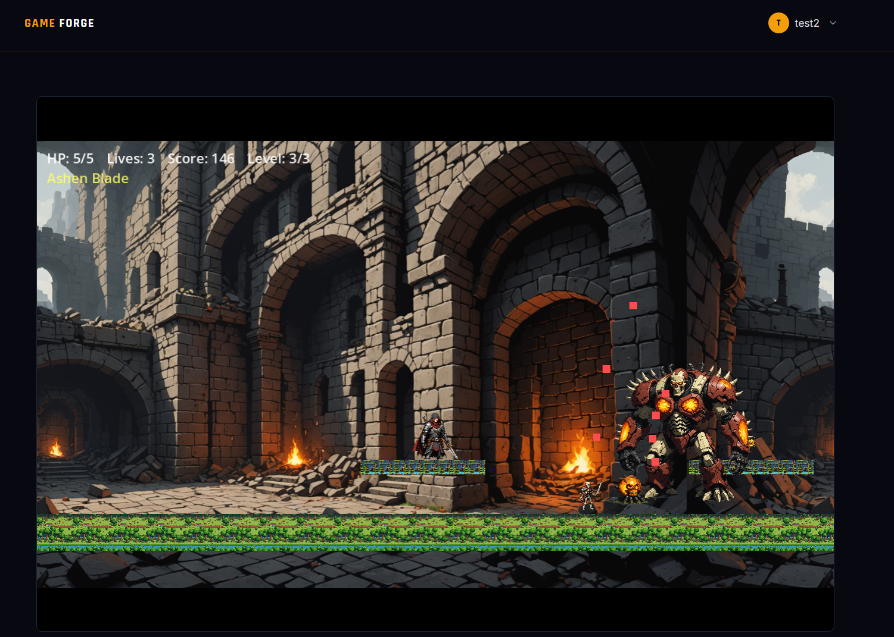
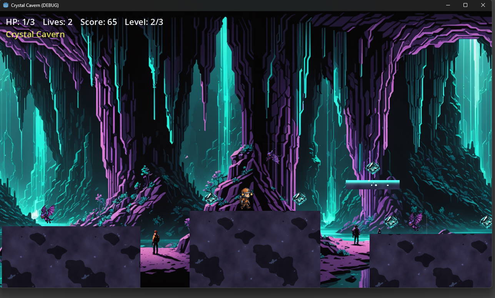
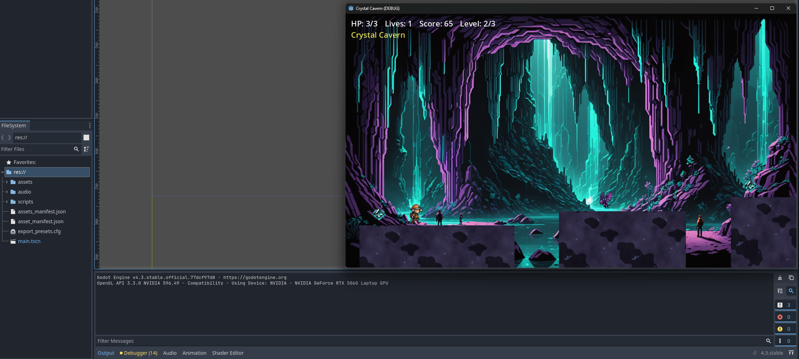

# Game Forge

Game Forge turns a natural-language description into a real, playable browser game. A user describes what they want, refines the design through an AI chat, and receives a Godot 4 HTML5 export that runs directly in the browser or can be downloaded and played offline.

The system is a distributed pipeline of nine services: an AI planner classifies the request and produces a structured game design, an asset generator produces sprites, backgrounds, and music with Stability AI, a code assembler builds a verified Godot project from that design, and a builder service compiles and exports it — all coordinated by a stateless orchestrator behind a REST API and a React front end.

## Table of Contents

- [Overview](#overview)
- [Screenshots](#screenshots)
- [Architecture](#architecture)
- [Pipeline Flow](#pipeline-flow)
- [Service Catalogue](#service-catalogue)
- [Tech Stack](#tech-stack)
- [Getting Started](#getting-started)
- [Configuration](#configuration)
- [Repository Layout](#repository-layout)
- [Testing and Quality](#testing-and-quality)
- [Performance](#performance)
- [Design Principles and Limitations](#design-principles-and-limitations)
- [Team](#team)

## Overview

Traditional game engines require programming and art skills before a single prototype can be played. Game Forge removes that barrier for simple 2D game concepts: a user types a prompt such as *"a dark fantasy platformer where a knight fights through a ruined castle"*, and the system plans, illustrates, scores, assembles, and compiles a working game without any manual engine work.

The platform supports three verified game archetypes — **platformer**, **top-down**, and **endless-runner** — each backed by a catalog of pre-written, Godot-verified behaviors, weapons, and win conditions. This constrains generation to combinations that are guaranteed to compile and run, trading unlimited creative freedom for a playable result on every request.

## Screenshots

| A generated platformer, played in the browser | The HTML5 export running standalone | The assembled project open in the Godot editor |
| :---: | :---: | :---: |
|  |  |  |

## Architecture

```
                ┌───────────┐
                │ frontend  │ :3000   React UI
                └─────┬─────┘
                      │ /api/*
                ┌─────▼─────┐
                │  backend  │ :5000   REST API + auth + /internal
                └─────┬─────┘         owns User, Chat, GameProject,
                      │               GenerationJob, Build
                      │ POST /generate
                ┌─────▼─────┐
                │  server   │ :6100   Orchestrator (HTTP only,
                └─────┬─────┘         no DB, no storage)
        ┌─────────────┼──────────────┬──────────────┐
        │             │              │              │
   ┌────▼────┐  ┌─────▼─────┐  ┌─────▼────┐  ┌─────▼─────┐
   │ planner │  │   asset   │  │   code   │  │  builder  │
   │  :6101  │  │   :6102   │  │  :6103   │  │   :6104   │
   │  LLM    │  │  LLM +    │  │  pure    │  │  Godot +  │
   │GamePlan │  │ MCP tools │  │ assembly │  │  MinIO ↘  │
   │         │  │ + MinIO ↗ │  │ + MinIO ↗│  │ (export)  │
   └────┬────┘  └─────┬─────┘  └──────────┘  └─────┬─────┘
        │             │ MCP calls              updates Build
        │        ┌────▼────┐               via backend /internal
        │        │assets-  │ :8765
        │        │  mcp    │  Stability AI
        │        └─────────┘  image + audio
        │
        └─────────────────────────────────────────────┐
                              │                       │
                  ┌───────────┴───────────┐           │
                  │                       │           │
            ┌─────▼─────┐           ┌─────▼─────┐    │
            │   mongo   │ :27017    │   minio   │ :9000 / :9001
            └───────────┘           └───────────┘
```

## Pipeline Flow

When a user requests generation:

1. The frontend submits the prompt to the backend, which creates a `GameProject`, `GenerationJob`, and `Build`, then hands off to the orchestrator.
2. The orchestrator returns immediately and runs the pipeline in the background:
   - **Planner** classifies the prompt into an archetype and fills a strict, schema-validated `GamePlan` (entities, levels, behaviors, weapons, win conditions).
   - **Asset** and **Code** run in parallel. Asset composes prompt specs with an LLM, then deterministically drives Stability AI (via MCP) to generate sprites, backgrounds, terrain, and music, uploading everything to object storage. Code assembles a complete Godot project from pre-verified GDScript fragments — no LLM involved — and validates it with the Godot CLI.
   - **Builder** downloads the assembled project and assets, runs the Godot 4 CLI to export an HTML5 build, and uploads the result.
3. Job and build status is pushed back to the backend throughout, and the frontend polls for progress until the game is ready to play.

## Service Catalogue

| Service      | Port      | Responsibility                                              |
| ------------ | --------- | ------------------------------------------------------------ |
| `frontend`   | 3000      | React UI — prompt input, AI chat refinement, in-browser play |
| `backend`    | 5000      | REST API, authentication, canonical data models              |
| `server`     | 6100      | Stateless HTTP orchestrator — no database, no storage        |
| `planner`    | 6101      | LLM-driven game design → structured `GamePlan`                |
| `asset`      | 6102      | LLM prompt composition → MCP tools → Stability AI → MinIO    |
| `code`       | 6103      | Deterministic GDScript assembly from a verified fragment library |
| `builder`    | 6104      | Godot 4 CLI export to HTML5, uploaded to MinIO                |
| `assets-mcp` | 8765      | MCP server wrapping Stability AI image/audio generation       |
| `mongo`      | 27017     | Primary database                                              |
| `minio`      | 9000/9001 | S3-compatible object storage for assets and builds             |

## Tech Stack

- **Frontend:** React 18, Vite, Tailwind CSS
- **Backend / Orchestrator / Workers:** Node.js, Express, Mongoose
- **Asset Server:** Python 3.13, FastMCP, Pydantic
- **Game Engine:** Godot 4.3 (headless CLI export to HTML5)
- **AI Providers:** LLMs via OpenRouter / Groq, image and audio generation via Stability AI
- **Data Layer:** MongoDB, MinIO (S3-compatible object storage)
- **Infrastructure:** Docker Compose

## Getting Started

Requires **Docker Desktop**.

```bash
# 1. Copy env templates and fill in secrets
cp game-forge/.env.example game-forge/.env
cp game-forge-backend/.env.example game-forge-backend/.env
cp game-forge-frontend/.env.example game-forge-frontend/.env
cp game-forge-server/.env.example  game-forge-server/.env

# 2. Edit game-forge/.env to set OPENROUTER_API_KEY and STABILITY_API_KEY

# 3. Bring up the stack
cd game-forge
docker compose up -d --build
```

| URL                                | What                                                  |
| ----------------------------------- | ---------------------------------------------------- |
| http://localhost:3000               | Frontend                                             |
| http://localhost:5000/api/health    | Backend health                                       |
| http://localhost:6100/health        | Orchestrator health                                  |
| http://localhost:6101–6104/health   | Worker services                                      |
| http://localhost:9001               | MinIO console                                        |

### Common Operations

```bash
# Tail logs from one service
docker compose logs -f builder

# Restart a single service after editing its code
docker compose up -d --force-recreate --build planner

# Stop everything (volumes preserved)
docker compose down

# Remove everything including mongo + minio data
docker compose down -v
```

## Configuration

`game-forge/.env` is the compose interpolation file; Compose substitutes `${VAR}` references in `docker-compose.yml` from it.

| Variable                            | Default                             | Purpose                                                                |
| ------------------------------------ | ------------------------------------ | ------------------------------------------------------------------------ |
| `GEN_SERVICE_SECRET`                | empty                                | Inter-service authentication header                                    |
| `OPENROUTER_API_KEY`                | empty                                | Required for planner, asset prompt composition, and backend chat        |
| `STABILITY_API_KEY`                 | empty                                | Required for all image and music generation                            |
| `PLANNER_PROVIDER` / `PLANNER_MODEL` | `openrouter` / `qwen/qwen3-32b`      | LLM used for game design                                                |
| `THEME_PROVIDER` / `THEME_MODEL`     | `openrouter` / `qwen/qwen3-32b`      | LLM used for sprite/background/music prompt composition                |
| `SKIP_GODOT_EXPORT`                 | `false`                              | When `true`, the builder writes stub artifacts instead of running Godot |
| `MINIO_ACCESS_KEY` / `MINIO_SECRET_KEY` | Must match `MINIO_ROOT_USER` / `MINIO_ROOT_PASSWORD` on the MinIO container |

## Repository Layout

```
Root/
├── game-forge/             ← orchestration root (this repository)
├── game-forge-frontend/    ← React UI
├── game-forge-backend/     ← REST API, auth, canonical models
├── game-forge-server/      ← HTTP orchestrator
├── game-forge-planner/     ← planner microservice
├── game-forge-asset/       ← asset microservice
├── game-forge-code/        ← code microservice
├── game-forge-builder/     ← builder microservice
└── assets-mcp/             ← MCP server (Stability AI wrapper)
```

## Testing and Quality

The pipeline spans nine services, so testing is split into three layers: isolated unit tests for pure functions and models, HTTP-contract integration tests using Supertest against each service's Express routes, and separate runtime performance benchmarks. All external dependencies — the LLM provider, Stability AI, MongoDB, MinIO, and the Godot CLI — are mocked in unit and integration tests, so no suite requires live API keys, quota, or a running Docker stack.

| Service               | Technology                        | Tests                          |
| ---------------------- | ---------------------------------- | -------------------------------- |
| `game-forge-frontend`  | React 18, Vite, Tailwind CSS       | 65 unit/component tests          |
| `game-forge-backend`   | Node.js, Express, Mongoose         | 66 unit, 12 integration          |
| `game-forge-server`    | Node.js, Express                   | 44 unit, 10 integration          |
| `game-forge-planner`   | Node.js, Express, OpenRouter       | 37 unit, 7 integration           |
| `game-forge-asset`     | Node.js, Express, MCP client       | 38 unit, 8 integration           |
| `game-forge-code`      | Node.js, Express, Godot assembly   | 124 unit, 9 integration          |
| `game-forge-builder`   | Node.js, Express, Godot CLI        | 34 unit, 8 integration           |
| `assets-mcp`           | Python 3.13, FastMCP, Pydantic     | 60 unit tests                    |
| **Total**              |                                     | **522 tests, all passing**       |

Four dedicated benchmark suites (`game-forge/benchmarks/`) were used to select the production LLM for each AI-driven role — game plan generation, code generation, audio prompt composition, and visual theme composition — by scoring outputs against fixed quality rubrics across multiple candidate models.

## Performance

Metrics below were captured from 12 days of real production usage (33 recorded pipeline runs).

| Metric                                  | Value                        |
| ----------------------------------------- | ------------------------------- |
| Pipeline success rate (terminal runs)     | 65%                           |
| Mean end-to-end generation time           | 276.5 s (≈ 4 min 37 s)        |
| Median end-to-end generation time         | 268.2 s                       |
| Fastest / slowest successful run          | 109.7 s / 453.1 s             |
| Playable web builds produced              | 13                             |
| Mean deliverable bundle size              | 67.7 MB                       |

Per-stage latency on a successful run is dominated by asset generation (≈ 79% of total wall-clock time), since sprite, background, terrain, and music calls to Stability AI are issued sequentially. Planning accounts for roughly 15%, and the Godot export stage — fully deterministic — contributes only about 3%.

## Design Principles and Limitations

Game Forge is built around one core trade-off: guaranteed playable output over unbounded creative freedom. Every generated game is assembled from a fixed, Godot-verified catalog of archetypes, behaviors, weapons, and win conditions, rather than freely generated code — so the pipeline can validate output before it ever reaches the player.

Known constraints stemming from this design include a fixed set of three supported archetypes, a fallback to a generic plan when the LLM output cannot be parsed after retries, single still-image sprites rather than frame-by-frame animation, and sequential (not batched) asset generation that dominates end-to-end latency. These trade-offs are documented in detail, alongside the rest of the project's design and evaluation, in [`docs/`](docs).

## Team

Game Forge is a graduation project built by:

- Omar Mohamed
- Ahmed Saber
- Amr Mohammed El-Sheraey
- Omar Mahfouz
