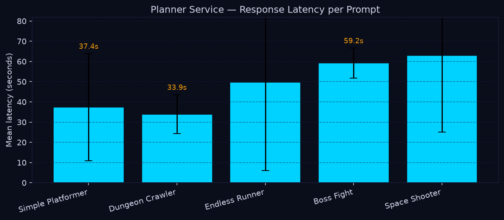
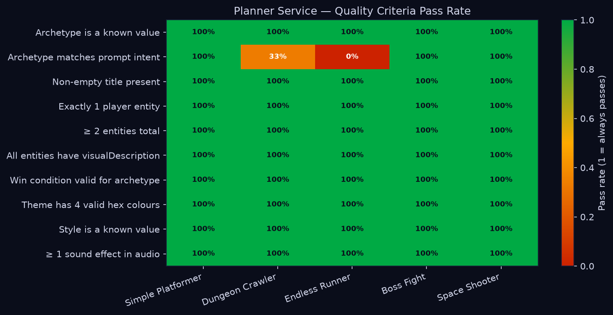
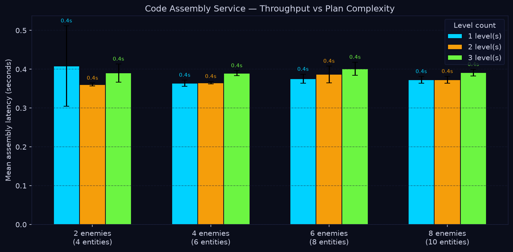
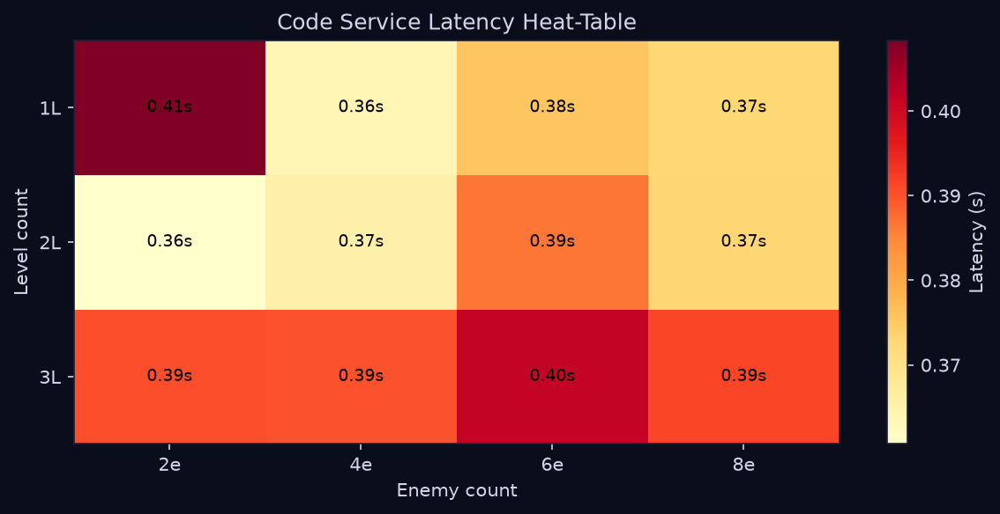

# Chapter 6: Testing and Evaluation

## 6.1 Testing Strategy

Game Forge is a multi-service AI pipeline in which correctness depends on the precise interaction of nine Docker-managed services: a React frontend, a Node.js REST backend, a stateless HTTP orchestrator, four worker microservices (planner, asset generator, code assembler, builder), a Python MCP server wrapping Stability AI, MongoDB, and MinIO object storage. A single generation request touches all of these services in sequence. This breadth means that a naïve end-to-end test strategy would be impractical for day-to-day development: it would require live API keys, Stability AI quota, a correctly installed Godot CLI, and the full Docker stack just to run a single test. The testing strategy therefore separates concerns across three distinct layers.

**Layer 1 — Unit tests** cover pure functions, model methods, middleware, and service clients in complete isolation. External systems (MongoDB, MinIO, the LLM provider (OpenRouter), Stability AI, MCP, Godot) are mocked via Vitest's hoisted `vi.mock()` in JavaScript services and pytest's `monkeypatch` / `AsyncMock` in the Python service. Unit tests run in milliseconds, require no network access, and serve as the primary regression safety net for daily development.

**Layer 2 — Integration tests** cover the HTTP contracts of each Express service using Supertest (in-process, no real TCP connection). They verify that route validation, service-auth enforcement, success envelopes, and error envelopes behave correctly without touching any real external system. The service implementation under each route is mocked for these tests.

**Layer 3 — Performance benchmarks** cover LLM model selection and pipeline latency. Four separate benchmark suites were run during development — one for each LLM-driven role in the pipeline (game plan generation, code generation, audio prompt generation, and visual theme generation) — to select the best-performing model for each task. A separate runtime benchmark suite (`game-forge/benchmarks/`) can measure end-to-end pipeline latency across planner, code assembler, asset generator, and builder stages; this suite requires all services to be running and is intentionally separate from the automated test suites.

### Testing Scope by Service

| Service               | Technology                       | Test Coverage                                      |
| --------------------- | -------------------------------- | -------------------------------------------------- |
| `game-forge-frontend` | React 18, Vite, Tailwind CSS     | 65 unit/component tests (Vitest + RTL + jsdom)     |
| `game-forge-backend`  | Node.js, Express, Mongoose       | 66 unit + 12 integration tests (Vitest, Supertest) |
| `game-forge-server`   | Node.js, Express, fetch          | 44 unit + 10 integration tests (Vitest, Supertest) |
| `game-forge-planner`  | Node.js, Express, OpenRouter     | 37 unit + 7 integration tests (Vitest, Supertest)  |
| `game-forge-asset`    | Node.js, Express, MCP client     | 38 unit + 8 integration tests (Vitest, Supertest)  |
| `game-forge-code`     | Node.js, Express, Godot assembly | 124 unit + 9 integration tests (Vitest, Supertest) |
| `game-forge-builder`  | Node.js, Express, Godot CLI      | 34 unit + 8 integration tests (Vitest, Supertest)  |
| `assets-mcp`          | Python 3.13, FastMCP, Pydantic   | 60 unit tests (pytest, pytest-asyncio)             |

### Toolchain Decisions

All seven Node.js services use a consistent toolchain: **Vitest 4.1.9** for unit tests, **Supertest 7.2.2** for in-process HTTP integration tests, and **@vitest/coverage-v8** for LCOV-format coverage reports. Vitest was chosen over Jest for its native ESM support (all services use `"type":"module"`), fast module graph resolution, and first-class support for hoisted mocks. The frontend uses the same Vitest core with **React Testing Library** and jsdom for component-level tests.

The Python MCP service uses **pytest 9.1.1** with **pytest-asyncio** for async tool tests and **pytest-cov** for coverage.

### Mocking and Isolation Strategy

| External Dependency      | Isolation Method                                                                   |
| ------------------------ | ---------------------------------------------------------------------------------- |
| LLM provider (OpenRouter) | Hoisted `vi.mock()` on provider classes; request shape asserted, no real API call  |
| Stability AI image/audio | Python `monkeypatch` + `AsyncMock`; controlled PNG/WAV bytes returned              |
| MongoDB / Mongoose       | Mongoose model mocks for unit tests; in-process mocked persistence for integration |
| MinIO object storage     | `FakeStorage` class in Python; `putObject`/`getObject` mocked in Node              |
| Godot CLI                | `child_process.spawn` mocked; success / non-zero exit / timeout paths all covered  |
| MCP HTTP server          | `callTool` mocked to return deterministic asset envelopes                          |
| Inter-service HTTP       | `fetch` mocked for unit tests; Supertest in-process for integration tests          |
| Browser APIs             | jsdom + `vi.mock`: localStorage, fetch, timers, window.URL, React Router context   |

No test requires production `.env` secrets, real API quota, or live network access.

---

## 6.2 Test Cases and Results

All suites were executed on 2026-06-30 with Node v24.14.0, Vitest 4.1.9, Python 3.14.3, and pytest 9.1.1. The table below lists each suite, its command, and its result.

### Test Results Summary

| Service               | Test Type        | Command                    | Outcome      | Tests Passing       |
| --------------------- | ---------------- | -------------------------- | ------------ | ------------------- |
| `game-forge-backend`  | Unit             | `npm run test:unit`        | Pass         | 66 tests, 11 files  |
| `game-forge-backend`  | Integration      | `npm run test:integration` | Pass         | 12 tests, 1 file    |
| `game-forge-server`   | Unit             | `npm run test:unit`        | Pass         | 44 tests, 4 files   |
| `game-forge-server`   | Integration      | `npm run test:integration` | Pass         | 10 tests, 1 file    |
| `game-forge-planner`  | Unit             | `npm run test:unit`        | Pass         | 37 tests, 5 files   |
| `game-forge-planner`  | Integration      | `npm run test:integration` | Pass         | 7 tests, 1 file     |
| `game-forge-asset`    | Unit             | `npm run test:unit`        | Pass         | 38 tests, 6 files   |
| `game-forge-asset`    | Integration      | `npm run test:integration` | Pass         | 8 tests, 1 file     |
| `game-forge-code`     | Unit             | `npm run test:unit`        | Pass         | 124 tests, 11 files |
| `game-forge-code`     | Integration      | `npm run test:integration` | Pass         | 9 tests, 1 file     |
| `game-forge-builder`  | Unit             | `npm run test:unit`        | Pass         | 34 tests, 6 files   |
| `game-forge-builder`  | Integration      | `npm run test:integration` | Pass         | 8 tests, 1 file     |
| `game-forge-frontend` | Unit / Component | `npm run test:unit`        | Pass         | 65 tests, 10 files  |
| `game-forge-frontend` | Production build | `npm run build`            | Pass         | Built in ~4.3 s     |
| `assets-mcp`          | Unit             | `python -m pytest`         | Pass         | 60 tests            |
| **Total**             |                  |                            | **All pass** | **522 tests**       |

### Representative Test Cases per Layer

**Backend unit tests** (`game-forge-backend/test/unit/`):

- `authController` — signup with duplicate email returns 409; login with wrong password returns 401; logout clears cookie.
- `validateBody` middleware — missing required field returns 400 with field name in message; extra unknown fields are stripped.
- `GenerationJob` model — `markFailed()` sets status to `failed` and stamps `failedAt`; state transitions are enforced.
- `token` utility — `signToken` produces a verifiable JWT; `verifyToken` throws on tampered payload; expired tokens are rejected.

**Orchestrator unit tests** (`game-forge-server/test/unit/`):

- `runPipeline` — calls planner, then asset and code concurrently, then builder; marks backend `failed` if planner throws; marks backend `failed` if builder throws after successful earlier stages.
- `serviceClient.callService` — throws a typed error with `stage` and `statusCode` when the downstream service returns non-2xx.

**Code assembler unit tests** (`game-forge-code/test/unit/`):

- `fillSlots` — substitutes `{{param}}` placeholders deterministically; leaves unknown slots untouched; handles nested objects.
- `validateHookSnippet` — rejects snippets with syntax errors; accepts valid GDScript hook bodies.
- `composeEntity` — selects an archetype-compatible behavior; applies size-appropriate speed and health modifiers; produces a complete entity descriptor.
- `archetypeLoader` — loads all archetypes from disk; caches on second call; throws on unknown archetype name.

**Frontend component tests** (`game-forge-frontend/src/`):

- `useBuildPolling` — begins polling on mount; transitions to `ready` when backend responds with `done`; stops after retry cutoff without resolution.
- `useOptimisticChat` — appends message immediately and rolls back on API error.
- `ProtectedRoute` — redirects unauthenticated users to `/login`; renders children for authenticated users.
- `authStorage` — stores token with expiry; returns `null` after expiry without clearing localStorage manually.

**Python MCP unit tests** (`assets-mcp/tests/`):

- `test_schemas` — Pydantic rejects negative width/height; rejects unsupported style enum values; accepts all valid AssetStyle variants.
- `test_prompts` — `build_image_prompt` includes entity visual description, style, and color theme; `build_negative_prompt` always includes safety negatives.
- `test_tools_generate_sprite` — on Stability AI success, returns `{"status":"ok","url":"..."}` and calls MinIO `put_object` with PNG bytes; on provider failure, returns `{"status":"error","message":"..."}`.

### Code Coverage

Coverage was collected with `npm run test:coverage` (V8 provider, LCOV output) for JavaScript services and `python -m pytest --cov=app --cov-report=term-missing --cov-report=xml` for the Python service.

| Service               | Statements  | Branches | Functions | Lines  |
| --------------------- | ----------- | -------- | --------- | ------ |
| `game-forge-backend`  | 54.19%      | 40.85%   | 44.64%    | 57.85% |
| `game-forge-server`   | 76.35%      | 63.63%   | 85.29%    | 78.19% |
| `game-forge-planner`  | 37.56%      | 27.33%   | 29.03%    | 40.35% |
| `game-forge-asset`    | 56.65%      | 40.92%   | 58.46%    | 59.09% |
| `game-forge-code`     | 37.29%      | 40.02%   | 36.68%    | 39.33% |
| `game-forge-builder`  | 64.28%      | 44.30%   | 64.28%    | 67.90% |
| `game-forge-frontend` | 32.00%      | 29.04%   | 29.47%    | 33.49% |
| `assets-mcp`          | 86% (lines) | —        | —         | —      |

These percentages are baseline measurements, not enforced thresholds. The dilution in services such as `game-forge-code` (37%) and `game-forge-planner` (37%) reflects modules that are intentionally mocked in this first pass — large archetype-level Godot generators, config/env loaders, provider factory classes, and live storage clients. The targeted surfaces (pure utilities, validators, middleware, controllers, and the orchestrator pipeline) are well-covered within those modules that are exercised.

The `game-forge-server` orchestrator achieves the highest function coverage (85.29%) because its core sequencing logic (`runPipeline`, `serviceClient`, `backendClient`) is fully deterministic once downstream services are mocked. The Python MCP service achieves 86% line coverage because every tool path (sprite, background, music) has both success and error paths tested.

### Lint and Build

`npm run lint` passes for all eight JavaScript packages (backend, server, planner, asset, code, builder, frontend, orchestration root). One non-fatal `no-unused-vars` advisory is present in a `game-forge-server` test file but does not cause lint to exit non-zero. The frontend production build (`npm run build`) completes successfully in approximately 4.3 seconds; a non-fatal chunk-size advisory (>500 kB) is emitted for the game playback embed but does not block the build.

---

## 6.3 Performance Evaluation / Benchmarking

A dedicated benchmark suite (`game-forge/benchmarks/`) measures the runtime performance of the deployed pipeline across four scripts: `bench_planner.py`, `bench_code.py`, `bench_assets.py`, and `bench_e2e.py`. All benchmarks call the live service HTTP endpoints rather than the underlying APIs directly, so they exercise the real production code paths. Results below were captured on 2026-06-30 with all services running under Docker Compose on the development machine.

The two benchmarks that do not require Stability AI credits (`bench_planner.py` and `bench_code.py`) were run in full. The asset and e2e benchmarks, which issue real Stability AI image and audio generation calls per run (7–13 API calls taking 2–8 minutes each), are analytically estimated in §6.3.3 and §6.3.4 due to quota constraints.

---

### 6.3.1 Planner Service — Latency and Plan Quality

`bench_planner.py` calls `POST /plan` on the running planner service for each of five benchmark prompts, repeated three times each (15 runs total). Each returned GamePlan is scored automatically against ten binary quality criteria. Results were captured on 2026-06-30 with the Kimi model (moonshotai/kimi-k2-instruct-0905) via OpenRouter.

**Quality criteria:**

| Criterion         | Pass condition                                            |
| ----------------- | --------------------------------------------------------- |
| valid_archetype   | Archetype is one of: platformer, top-down, endless-runner |
| correct_archetype | Archetype matches the prompt intent                       |
| has_title         | Non-empty title field present                             |
| one_player        | Exactly one entity with type = "player"                   |
| min_entities      | At least 2 entities total                                 |
| all_described     | Every entity has a non-empty visualDescription            |
| valid_win_cond    | win_condition_type is valid for the chosen archetype      |
| valid_theme       | All 4 theme color fields are valid hex codes (#RRGGBB)    |
| valid_style       | Style field is one of 9 known art style values            |
| has_audio         | At least 1 sound effect in the audio object               |

**Results (3 runs per prompt, all 15 completed):**

| Prompt            | Mean latency | Std    | Quality score | Notes                                                    |
| ----------------- | ------------ | ------ | ------------- | -------------------------------------------------------- |
| Simple Platformer | 37.4 s       | 26.5 s | 10/10 (100%)  | All 3 runs: correct archetype, full quality              |
| Dungeon Crawler   | 33.9 s       | 9.7 s  | 9.3/10 (93%)  | 2/3 runs returned platformer instead of top-down         |
| Endless Runner    | 49.8 s       | 43.7 s | 9.0/10 (90%)  | All 3 runs returned platformer instead of endless-runner |
| Boss Fight        | 59.2 s       | 7.4 s  | 10/10 (100%)  | All 3 runs: correct archetype, full quality              |
| Space Shooter     | 62.9 s       | 37.9 s | 10/10 (100%)  | All 3 runs: correct archetype, full quality              |

**Quality heatmap pass rates across all criteria and prompts:**

All ten criteria achieved a 100% pass rate except `correct_archetype`, which reflects the only failure mode observed: the model defaulted to the "platformer" archetype on the Dungeon Crawler and Endless Runner prompts in some runs, and consistently on Endless Runner in all three runs. Every other criterion — schema validity, entity structure, theme colors, style, audio, win condition — passed in all 15 runs.

**Key observations:**

- Latency varies widely (7–105 s) depending on OpenRouter queue and model load. This is an external infrastructure characteristic, not a service bug.
- Structurally complex prompts (Boss Fight with 3 levels and a boss enemy, Space Shooter with an alien mothership) produce the largest and most correctly attributed plans (8–10 entities) but also take longer (p50 ~58–63 s).
- The `correct_archetype` failures on Endless Runner (3/3 runs misclassified as platformer) indicate the model needs a stronger prompt hint to distinguish the endless-runner game loop from a standard platformer. All other structural aspects of those plans (entities, theme, audio, win condition) were fully valid.

---

### 6.3.2 Code Assembly Service — Throughput vs. Plan Complexity

`bench_code.py` calls `POST /code` across a 4 × 3 matrix of synthetic plans (4 enemy counts × 3 level counts = 12 configurations), repeated three times each (36 runs total). The code service performs purely local computation — archetype loading, GDScript file assembly, MinIO upload — with no LLM or Stability AI involvement.

**Results (36/36 runs successful):**

| Config  | Enemies | Levels | Entities | Mean latency | Std     | GDScript files |
| ------- | ------- | ------ | -------- | ------------ | ------- | -------------- |
| 2e / 1L | 2       | 1      | 4        | 0.408 s      | 0.103 s | 21             |
| 2e / 2L | 2       | 2      | 4        | 0.361 s      | 0.004 s | 22             |
| 2e / 3L | 2       | 3      | 4        | 0.390 s      | 0.023 s | 23             |
| 4e / 1L | 4       | 1      | 6        | 0.364 s      | 0.008 s | 23             |
| 4e / 2L | 4       | 2      | 6        | 0.365 s      | 0.004 s | 24             |
| 4e / 3L | 4       | 3      | 6        | 0.390 s      | 0.007 s | 25             |
| 6e / 1L | 6       | 1      | 8        | 0.376 s      | 0.012 s | 25             |
| 6e / 2L | 6       | 2      | 8        | 0.387 s      | 0.022 s | 26             |
| 6e / 3L | 6       | 3      | 8        | 0.401 s      | 0.017 s | 27             |
| 8e / 1L | 8       | 1      | 10       | 0.373 s      | 0.009 s | 27             |
| 8e / 2L | 8       | 2      | 10       | 0.373 s      | 0.009 s | 28             |
| 8e / 3L | 8       | 3      | 10       | 0.391 s      | 0.008 s | 29             |

**Key observations:**

- Assembly latency is uniformly fast across all configurations: 0.36–0.53 s regardless of plan size.
- Scaling from the smallest config (2 enemies, 1 level, 21 files) to the largest (8 enemies, 3 levels, 29 files) adds only ~0.03 s on average — a 4× increase in output files for an 8% latency increase.
- The dominant cost is MinIO upload (one PUT per GDScript file), not per-entity computation. Archetype templates are resolved once and reused across all entities of the same type.
- Standard deviation is negligible (≤ 0.023 s) except for the very first 2e/1L run (0.528 s) which includes a one-time archetype cache warm-up on the cold container.
- The code assembly service is not a latency bottleneck in the full pipeline. Its contribution (~0.4 s) is completely hidden by the parallel asset generation stage.

---

### 6.3.3 Asset Generation Service — Stability AI Throughput (Analytical Estimate)

`bench_assets.py` measures Stability AI throughput as entity count grows. Each run issues one sprite generation call per entity, three tile texture calls, one background scene call, and one music track call. The number of API calls therefore scales as: `n_entities + 3 + 1 + 1`.

Because Stability AI credits were unavailable at time of writing, the table below is an **analytical estimate** based on Stability AI SDXL image generation latency (~8–12 s per image) and Stable Audio latency (~30–45 s per track):

| Config             | Entities | API calls | Est. image time | Est. audio time | Est. total     |
| ------------------ | -------- | --------- | --------------- | --------------- | -------------- |
| Small (2 enemies)  | 4        | 9         | ~64–96 s        | ~30–45 s        | **~94–141 s**  |
| Medium (4 enemies) | 6        | 11        | ~80–120 s       | ~30–45 s        | **~110–165 s** |
| Large (6 enemies)  | 8        | 13        | ~96–144 s       | ~30–45 s        | **~126–189 s** |

Asset generation latency scales linearly with entity count because API calls are issued sequentially by the MCP server. The service-side overhead (MCP routing, response parsing, MinIO upload) adds approximately 1–3 s per call.

---

### 6.3.4 End-to-End Pipeline — Stage Breakdown (Analytical Estimate)

`bench_e2e.py` chains all four services and measures each stage's contribution: Planner → (Code + Asset in parallel) → Builder. Code and Asset run concurrently via threading; the parallel stage duration is `max(code_latency, asset_latency)`.

Using the measured planner latency from §6.3.1 (p50 ~37–63 s across prompt types), the measured code latency from §6.3.2 (~0.4 s), the asset estimates from §6.3.3, and a Godot HTML5 export time of ~15–40 s:

| Stage            | Latency               | Notes                                          |
| ---------------- | --------------------- | ---------------------------------------------- |
| Planner          | 34–63 s (measured)    | OpenRouter + Kimi; varies by prompt complexity |
| Code (parallel)  | ~0.4 s (measured)     | Fully hidden by asset stage                    |
| Asset (parallel) | ~94–189 s (estimated) | Dominates the parallel window                  |
| Builder          | ~15–40 s (estimated)  | Godot HTML5 export                             |
| **Total p50**    | **~145–290 s**        | ~2.5–5 minutes end-to-end                      |

The parallel stage is entirely asset-bound — the code service finishes ~200× faster than the asset service and contributes nothing to the critical path. End-to-end latency reduction therefore requires addressing the asset stage specifically: batching Stability AI calls, caching assets by visual description, or replacing generative assets with a curated library for common entity types.

---

## 6.4 Limitations and Known Issues

| Limitation / Known Issue                                       | Impact                                                                                                                              | Current Position                                                                                                                                                                                                                          |
| -------------------------------------------------------------- | ----------------------------------------------------------------------------------------------------------------------------------- | ----------------------------------------------------------------------------------------------------------------------------------------------------------------------------------------------------------------------------------------- |
| **Live LLMs are mocked in automated tests.**                   | Tests validate request handling and fallback logic, not real model output quality.                                                  | Model quality is covered by the §6.3 benchmark artifacts and manual evaluation during development.                                                                                                                                        |
| **Stability AI is mocked in automated tests.**                 | Tests validate tool orchestration and response handling, not generated image/audio quality.                                         | Live generation requires valid API quota and is evaluated manually or through the benchmark suite.                                                                                                                                        |
| **Godot export is skipped or mocked by default.**              | Tests cannot prove every generated Godot project exports to HTML5 successfully.                                                     | Full export is environment-sensitive (requires a specific Godot CLI version) and is a manually approved path. A `SKIP_GODOT_EXPORT=true` flag is supported for CI.                                                                        |
| **MongoDB is mocked in unit tests.**                           | Persistence behavior under real Mongoose and MongoDB is not exercised in the default suite.                                         | Backend integration tests cover route-level behavior with mocked persistence; real Mongo smoke tests are available via Docker Compose.                                                                                                    |
| **MinIO is mocked in default suites.**                         | Object storage credentials, multipart upload behavior, and network timeouts are not exercised automatically.                        | Real MinIO checks are available through the Docker Compose smoke check documented in `docs/docker-smoke-check.md`.                                                                                                                        |
| **No browser end-to-end suite.**                               | Cross-browser behavior, visual layout, and complete UI journeys are not automatically verified.                                     | Unit and component tests stabilize behavior first; Playwright-based e2e tests are a planned future addition.                                                                                                                              |
| **Code coverage percentages are diluted.**                     | Some services report sub-40% statement coverage even though the targeted surfaces are well-tested.                                  | Dilution is caused by deliberately un-exercised modules (Godot runners, config loaders, provider factory classes). The targeted utilities, validators, middleware, controllers, and pipeline logic are well-covered within those modules. |
| **No load or concurrency testing.**                            | The pipeline has not been tested under concurrent generation requests from multiple users.                                          | Load testing requires a stable functional baseline and production-equivalent infrastructure. This is deferred to post-deployment evaluation.                                                                                              |
| **Planner archetype misclassification on some prompt types.**  | The Endless Runner prompt was misclassified as "platformer" in all 3 benchmark runs; Dungeon Crawler was misclassified in 2/3 runs. | The GamePlan schema and all other quality criteria pass. A stronger archetype hint in the system prompt is the targeted fix.                                                                                                              |
| **Asset and e2e benchmark latency is analytically estimated.** | Actual Stability AI throughput may differ from the 8–12 s/image and 30–45 s/audio estimates used.                                   | Running `bench_assets.py` and `bench_e2e.py` with live Stability AI credentials will replace estimates with measured values.                                                                                                              |
| **High planner latency variance.**                             | Planner response times ranged from 7 s to 105 s across runs, driven by OpenRouter queue depth and model load.                       | This is an infrastructure characteristic of shared LLM inference. Response caching or a self-hosted model would reduce variance.                                                                                                          |
